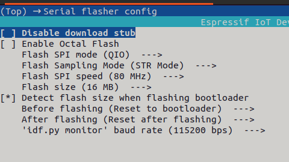
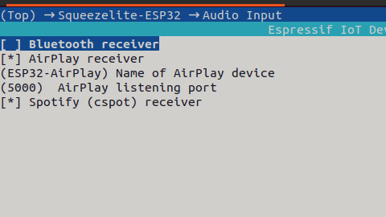
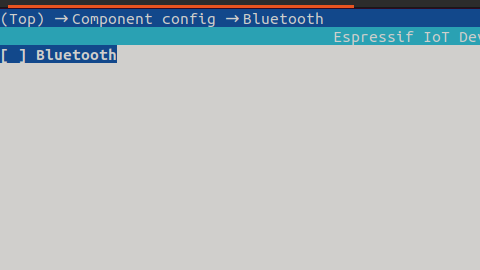
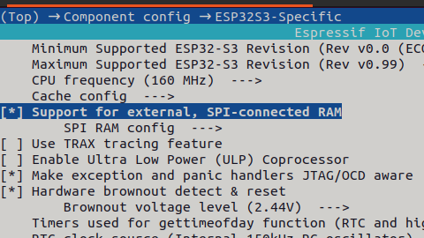
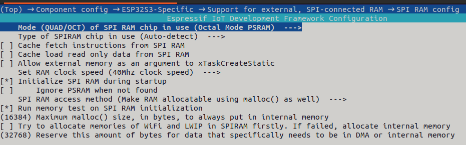
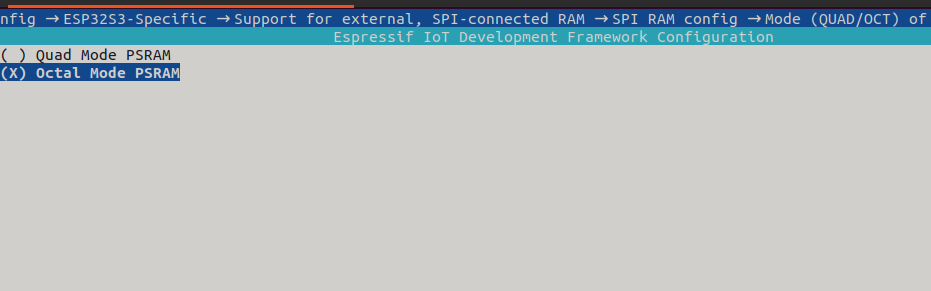
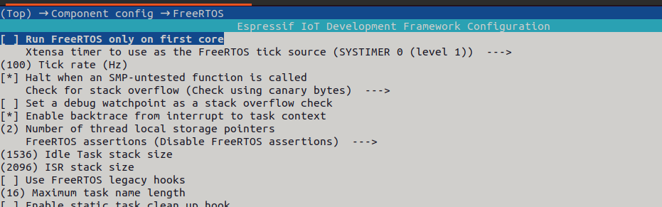

# Den Logitech Media Server mit RFID Karten steuern


## Inhalt

## Vorbemerkung
Den Logitech Media Server kann man gut mit Handy und Browser fernsteuern. Doch habe ich nicht immer mein Handy dabei und möchte auch gerne, dass meine Kinder selbständig Lieder und Hörbücher starten können. Für letzteres gibt es auch gute eigenständige Systeme, wie z.B. der TonUINO, aber gerade für ältere Kinder ist dies irgendwann nicht mehr zeitgemäß. Da ich selber schon länger den Logitech Media Server (LMS) nutze und meinen Kinder den irgendwann auch in deren Zimmer einbauen wollte, entschied ich mich, mir eine RFID - Steuerung für diesen einzurichten.

##Aufbau
Aus folgenden drei Komponenten besteht ein komplettes System


1. Server mit einer laufenden LMS Instanz. ([Ich nutze Docker](https://hub.docker.com/r/lmscommunity/lyrionmusicserver))
2. Einen Clienten, der die Musik wiedergibt. ([Ich nutze squeezelite-esp32](https://github.com/sle118/squeezelite-esp32))
3. Die hier vorgestellte RFID-Steuerung.

##Installation
### LMS Server
Zur Docker-Installation kopiere dir die Docker-Compose Datei auf deinen Server und starte diesen mit 
```
docker-compose up -d
```
###squeezelite-esp32
Für den Clienten braucht man folgende Teile:

1. ESP32-S3 Development Board (z.B. von Aliexpress)
2. DAC Module 1334 UDA1334A I2S DAC (z.B. von Aliexpress)
3. SONOFF Basic R2
4. USB Netzteil
5. USB Boxen

#### ESP32-S3 Installation
**Softwareinstallation**
```
mkdir ~/esp
cd ~/esp
git clone -b v4.4.4 --recursive https://github.com/espressif/esp-idf.git esp-idf-v4.4
/home/jochen/esp/esp-idf-v4.4/install.sh
. /home/jochen/esp/esp-idf-v4.4/export.sh
git clone --recursive https://github.com/sle118/squeezelite-esp32.git

```
**Konfiguration**
Passe mit dem Befehl "idf.py menuconfig" folgende Einstellungen an.









Führe dann folgende Befehle aus:
```
idf.py build
idf.py flash
```

**ESP32-S3 mit DAC verbinden**


