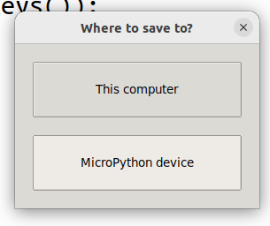

# Den Lyrion Media Server mit RFID Karten steuern

## Inhalt

* [Vorbemerkung](#vorbemerkung)
* [Aufbau](#aufbau)
* [Beispiel](#beispiel)
* [RFID Steuerung auf ESP32-Display](#rfidsteuerung)
* [RFID Karten Zuordnen](#rfidkartenzuordnen)
* [Installation restlicher Komponenten](#installationkomponenten)
* [ESP32-S3 Firmware selber erstellen](#esp32s3firmwareerstellen)

<a name="vorbemerkung"/>

## Vorbemerkung

Logitech hat vor lange Zeit einen kostenlosen Mediaserver bereit gestellt, mit dem man kostenlos seine Musik im ganzen Haus verteilen kann. Den Logitech Media Server oder kurz LMS. Man braucht einen Rechner, der als Server arbeit und die Musik an verschiedene Clienten schickt. Diese können Rechner, Raspberry Pis, Handys oder seit kurzen ESP32 sein. Gerade die ESP32 sind eine sehr günstige alternative, die Musik zu empfangen.

Den LMS kann man gut mit Handy und Browser fernsteuern. Doch habe ich nicht immer mein Handy dabei und möchte auch gerne, dass meine Kinder selbständig Lieder und Hörbücher starten können. Für letzteres gibt es auch gute eigenständige Systeme, wie z.B. der TonUINO, aber gerade für ältere Kinder ist dies irgendwann nicht mehr zeitgemäß. Da ich selber schon länger den Logitech Media Server (LMS) nutze und meinen Kinder den irgendwann auch in deren Zimmer einbauen wollte, entschied ich mich, mir eine RFID - Steuerung für diesen einzurichten.

<a name="aufbau"/>

## Aufbau

Aus folgenden drei Komponenten besteht ein komplettes System


1. Server mit einer laufenden LMS Instanz. ([Ich nutze Docker](https://hub.docker.com/r/lmscommunity/lyrionmusicserver))
2. Einen Clienten, der die Musik wiedergibt. ([Ich nutze squeezelite-esp32](https://github.com/sle118/squeezelite-esp32))
3. Die hier vorgestellte RFID-Steuerung.
4. Ein Pythonskript, welches den IDs der RFID-Karten einer Aktion zuordnen.

<a name="beispiel"/>

## Beispiel


<a name="rfidsteuerung"/>

## RFID Steuerung auf ESP32-Display

### Komponenten
* T-Display-S3 ESP32 S3 with 1.9 inch ST7789 LCD Display
* MFRC-522 Mini RC522
* Key Button Membrane Switch 3 ([Color: 5key-matrix-keyboard](https://www.aliexpress.com/item/1005004528531101.html))
* USB Schalter
* USB Powerbank
* Gehäuse aus dem 3D-Druck

### Firmware flashen
```
pip install esptool
esptool.py --chip esp32s3 --port /dev/ttyACM0 erase_flash
esptool.py --chip esp32s3 --port /dev/ttyACM0 write_flash -z 0 esp32-S3_display_firmware.bin
```

### LMS-Steuerung aufs Display laden
Zur Übertragung des Skripts auf das ESP32 Display benutze ich Thonny. Wähle Run --> Select Interpreter --> Micropython (ESP32) und suche dann den richtigen Port. Speicher damit *squeezeplayerSteuerung.py* als *main.py* auf dem Display.

Wähle zuerst den Interpreter:


Nimm MicroPython (ESP32) und den passenden Port:


Drücke auf Save Copy und wähle das Micropython Device:




### LMS-Steuerung anpassen
Rufe das Skript *paramter.py* in Thonny auf und passe folgende Angaben an:

* wlanname
* wlanpasswort
* squeezeclient
* lmsserverip
* rfidserverip


Speicher dann *parameter.py* auf dem Display.

### Komponenten Verbinden
**RFID**

| ESP32-S3 Display    | MFRC-522 Mini RC522|
| -------- | ------- |
| V3.3 | V3.3 |
| GND | GND     |
|  1 | MISO|
|  2 | MOSI |
|  3 | SCK|
| 10 | SDA|

**5 Button Switch**

| ESP32-S3 Display    | 5 Button Switch|  Beschriftung |
| -------- | ------- | ------- |
| GND | 1  |    |
|  43 | 2  |SEL |
|  44 | 3  |DEC |
|  18 | 4  |INC |
| 17  | 5  |BEFORE |
| 21  | 6  |NEXT|

Ich habe den 5er Taster direkt an das ESP32 gelötet, um Platz zu sparen. Nicht gesteckt. Dazu habe ich den Stecker abgeschnitten und das die Enden der Kabel direkt an die Pins gelötet. Dadurch muss das Gehäuse nicht so hoch sein.

  

Da das Display die Schrauben verdeckt, klebe ich die Steuerung mit Heißkleber in das Gehäuse:

 


<a name="rfidkartenzuordnen"/>

## RFID Karten Zuordnen

Die RFID Karten werden mit Hilfe eines Python Skripts verschiednenen Musikordnern, -dateien, -streams, Hörbüchern oder An- Ausschaltern zugeordnet.

1. Kopiere das Skript *httpServerGetPost.py* und die Datei *rfidKarten.csv* auf einen Server in den Ordner */home/pi/rfidLMS*
2. Kopiere als admin die Datei *rfidLMS.service* nach */lib/systemd/system*:  *sudo cp  rfidLMS.service /lib/systemd/system/*
3. Aktiviere das Skript als Service mit folgenden Befehlen:

```
sudo systemctl enable rfidLMS
sudo systemctl daemon-reload
sudo systemctl start rfidLMS
```
Möchtest du andere Pfade verwenden, passe die Ordner in den Skripten an. Ich habe die Datei *rfidKarten.csv* in einem Pfad gespeichert, auf dem ich per Samba mit meinem Handy zugriff habe, so kann ich einfach neue Karten in diese Datei einpflegen, indem ich mit dem NCF Reader meines Handy die Karten-ID auslese und diese einer Aktion zuordne.

<a name="installationkomponenten"/>

## Installation restlicher Komponenten

### LMS Server

Zur Docker-Installation [kopiere dir die Docker-Compose Datei](https://hub.docker.com/r/lmscommunity/lyrionmusicserver) auf deinen Server und starte den LMS Server mit 
```
docker-compose up -d
```
Richte den Server den eigenen Anforderungen entsprechend ein.

### squeezelite-esp32

#### Offiziele Clienten

Es gibt verschiedene Projekte, die direkt das Squeezelite-ESP32 unterstützen. Diese finden sich hier:

[Firmware for ESP Audio Dock](https://sonocotta.github.io/esp32-audio-dock/)

#### ESP32-S3

Aus Kostengründen nutze ich aber den ESP32-S3, welcher keine offiziele Unterstützung besitzt. Für den ESP32-S3 Clienten braucht man folgende Teile:

1. ESP32-S3 Development Board (z.B. von Aliexpress, auf 16MB achten: N16R8 - 8M psram, 16M flash)
2. DAC Module 1334 UDA1334A I2S DAC (z.B. von Aliexpress)
3. SONOFF Basic R2 (Zum An-Aus Schalten mitteils RFID-Karten)
4. USB Netzteil
5. USB Splitter, Eins auf Zwei (Nur ein Netzteil für Boxen und Esp32)
6. USB Boxen
7. 3.5mm Audio Aux Cable Anti-interference Ground Loop Noise Filter (Falls der Sound störgeräusche enthält. Dies kann bei mir vorkommen, wenn Boxen und ESP32-S3 am gleichen Netzteil hängen.)

#### ESP32-S3 Installation

**Softwareinstallation**

Für die 16 MB esp32-s3
```
pip install esptool
esptool.py --chip esp32s3 --port /dev/ttyACM0 erase_flash
esptool.py -p /dev/ttyACM0  -b 460800 --before default_reset --after hard_reset --chip esp32s3  write_flash --flash_mode dio --flash_size detect --flash_freq 80m 0x0 esp32s3_16MB_squeeze_bootloader.bin 0x8000 esp32s3_16MB_squeeze_partition-table.bin 0xd000 esp32s3_16MB_squeeze_ota_data_initial.bin 0x10000 esp32s3_16MB_squeeze_recovery.bin 0x150000 esp32s3_16MB_squeeze_squeezelite.bin

```


**ESP32-S3 mit DAC verbinden**

Verlöte folgende Punkte zwischen dem ESP und dem DAC

| ESP32-S3    | DAC 1334|
| -------- | ------- |
| V3.3 | V3.3 |
| GND | GND     |
|  42 | WSEL    |
|  41 | DIN |
|  40 | BCLK

Mache die Verbindung nicht zu kurz, sonst erzeugt der WLAN des esp32-S3 Störungen bei der Musikwiedergabe. 


**ESP32-S3 Einrichten**

Verbinde dich mit dem ESP32-S3 mit dem Handy, WLAN squeezelite-esp32, Passwort squeezelite. Richte dein Wlan ein und merk dir die IP-Adresse, mit der sich der Squeezelite mit deinem Heimnetz verbindet. Rufe nach dem Neustart diese IP-Adresse auf.

Richte unter Audio den Playername und den LMS-Server ein:


Richte unter Hardware den DAC entsprechend obiger Tabelle ein, bzw. deiner eigenen Verlötung:


**Autoconnect**

Die hier genuzte Version des esp32-squeezelite Players kann sich nicht selber mit dem Server verbinden. [Hier wird beschrieben, welcher Schritt nochfehlt](https://github.com/sle118/squeezelite-esp32/issues/411#issuecomment-2104861151)

Es muss noch autoexec 1 im NVS-Editor eingefügt werden:


Nach dem Neustart muss dies so aussehen:


### Sonoff Basic einrichten

Zum An und Auschalten der ESP32-S3 Clienten nutze ich den Sonoff Basic R2, welcher [mit einer Tasmota Firmaware geflasht wurde.](https://tasmota.github.io/docs/devices/Sonoff-Basic/)

**Sonoff Flashen**

Ablauf:

1. [Lade dir die Firmware herunter](https://ota.tasmota.com/tasmota/release/tasmota-DE.bin)
2. Öffne das Gehäuse
3. Löte 5 Pins an die richtige Stelle.
4. Verbinde die 5 Pins mit einem FT232RL USB-Serial Adapter, halte dabei den Reset-Knopf gedrückt.
5. Lösche den Speicher und flashe die Tasmota mit folgenden Befehlen:


```
esptool.py --port /dev/ttyUSB0 erase_flash
esptool.py --port /dev/ttyUSB0 write_flash -fs 1MB -fm dout 0x0 tasmota-DE.bin
```
[Hier ist eine ausführliche Anleitung mit Bildern.](https://medium.com/@jordanrounds/sonoff-basic-r2-tasmota-aa6f9d4e033f)

<a name="esp32s3firmwareerstellen"/>

## ESP32-S3 Firmware selber erstellen

Sollte dein ESP32-S3 nicht zu den hier vorgestellten Konfigurationen passen, erstelle deine eigene Firmware mit folgenden Befehlen:

```
mkdir ~/esp
cd ~/esp
git clone -b v4.4.4 --recursive https://github.com/espressif/esp-idf.git esp-idf-v4.4
~/esp/esp-idf-v4.4/install.sh
. ~/esp/esp-idf-v4.4/export.sh
git clone --recursive https://github.com/sle118/squeezelite-esp32.git
cd squeezelite-esp32
cp build-scripts/I2S-4MFlash-sdkconfig.defaults sdkconfig.defaults

```

Änder nun in der Datei sdkconfig.defaults die *CONFIG_IDF_TARGET="esp32"* zu *CONFIG_IDF_TARGET="esp32s3"*

**ESP32-S3 Konfigurieren**

Passe mit dem Befehl "idf.py menuconfig" folgende Einstellungen an. Da der ESP32-S3 kein Bluetooth hat, muss dies deaktiviert werden.


Führe dann folgende Befehle aus:

```
idf.py build
idf.py flash
```


